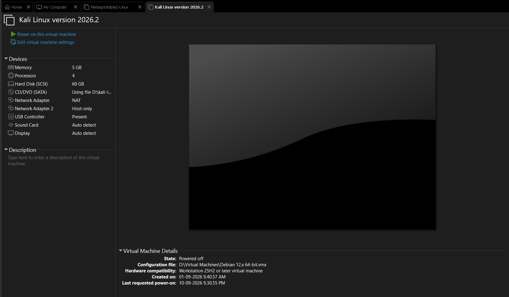
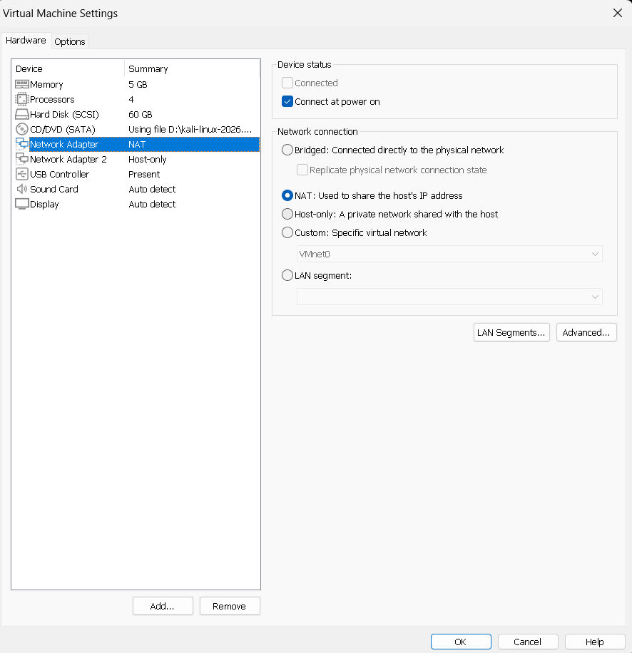
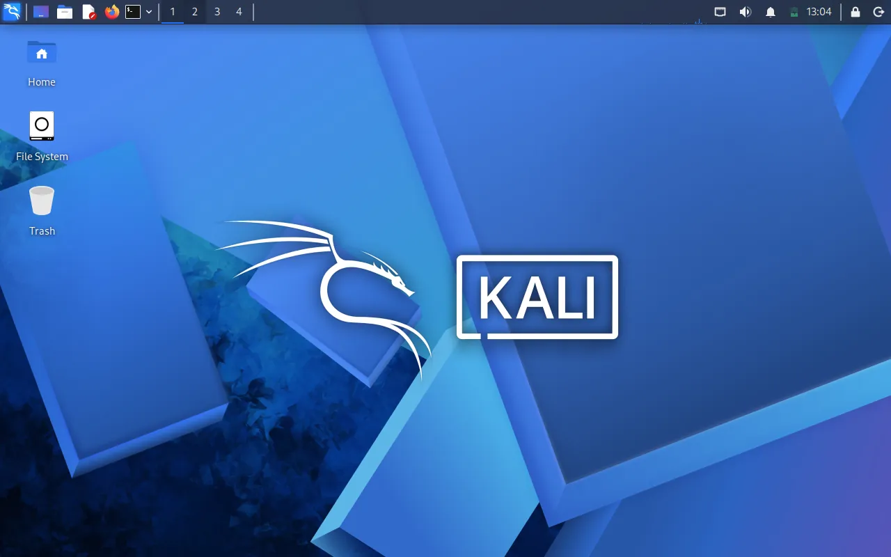
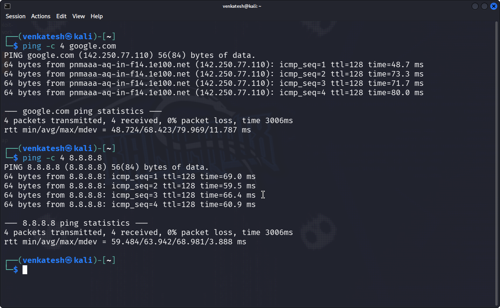

# 🔐 Cybersecurity Lab Environment Setup

**Building an isolated virtual lab for penetration testing and ethical hacking practice**


---

## 📌 Project Overview

This project documents setting up a **virtual cybersecurity and penetration-testing laboratory** using VMware Workstation and Kali Linux.

The goal is a controlled, isolated environment where network scanning, reconnaissance, vulnerability assessment, and other security-testing activities can be practiced safely and repeatedly, with additional target machines (starting with Metasploitable2) added to the same private network.

---

## 🎯 Objectives

- Install and configure VMware Workstation as the hypervisor.
- Import Kali Linux as a virtual machine.
- Configure a NAT-based virtual network for the lab.
- Add a vulnerable target VM (Metasploitable2) to the same network.
- Verify network connectivity and DNS resolution from Kali.
- Fix the recurring "eth0 not connected" issue on boot.
- Document the setup, problems, and fixes.
- Prepare the environment for future cybersecurity projects.

---

## 🛡️ Purpose of the Lab

The lab provides an isolated environment for cybersecurity learning and authorized security testing. It can be used for:

- Network reconnaissance
- Port scanning
- Vulnerability assessment
- Packet analysis
- Web security testing
- Exploitation practice against Metasploitable2
- Security-tool experimentation

⚠️ **Important:** This lab must only be used against systems I own or have explicit permission to test.

---

## 🏗️ Lab Architecture


The plan: a Windows 10 host running VMware Workstation, with all VMs on a shared NAT network (`10.0.0.2–99/24`) so Kali can reach target machines like Metasploitable2, and additional OSes can be added later without changing the network design.

---

## ⚙️ Lab Configuration

| 🧩 Component         | ⚙️ Configuration      |
| -------------------- | --------------------- |
| 🖥️ Host OS           | Windows 11            |
| 🧰 Hypervisor        | VMware Workstation    |
| 🐉 Security OS       | Kali Linux 2026.2     |
| 🧠 Kali RAM          | 5 GB                  |
| ⚙️ Kali Processors   | 4                     |
| 💽 Kali Hard Disk    | 60 GB (SCSI)          |
| 🌐 Network Adapter 1 | NAT                   |
| 🌐 Network Adapter 2 | Host-only             |
| 📡 Network Range     | 10.0.0.0/24           |
| 🎯 Target VM         | Metasploitable2-Linux |

---

# 🪜 Lab Setup Procedure

## Step 1. Install VMware Workstation

VMware Workstation was installed as the hypervisor to run and manage the lab VMs.

## Step 2. Import Kali Linux

The Kali Linux 2026.2 virtual machine was downloaded from the official Kali website and added to VMware Workstation.



The VM was allocated 5 GB RAM, 4 processors, and a 60 GB SCSI hard disk. A Metasploitable2-Linux VM was also added to the same library to serve as a future target machine.

## Step 3. Configure the Network Adapter

The Kali VM's Network Adapter was set to **NAT**, with a second Host-only adapter added for direct host-to-VM access.



NAT was chosen so Kali gets outbound internet access while staying isolated from the host's real network, and a NAT-based shared network lets future target VMs (like Metasploitable2) communicate with Kali.

## Step 4. Boot and Verify Kali Desktop

Kali Linux was powered on and the desktop verified.



## Step 5. Verify Network Connectivity

Connectivity was tested from a terminal inside Kali using `ping`.



```
ping -c 4 google.com   → 0% packet loss
ping -c 4 8.8.8.8      → 0% packet loss
```

Both external DNS resolution and raw connectivity to `8.8.8.8` succeeded, confirming the NAT adapter and DNS were working correctly.

---

# 🐞 Problems Encountered & Solutions

## Problem 1. eth0 Shows "Disconnected" Every Time Kali Boots

Every time the Kali VM was powered on, `eth0` came up as disconnected in NetworkManager, even though the VM's Network Adapter was correctly set to NAT. This meant no internet access until the connection was manually brought up each session.

**Diagnosis** — checked the current device status:

```bash
nmcli device status
```

This showed `eth0` present but in a disconnected state, with no active connection profile bound to it.

**Fix** — created a dedicated connection profile for `eth0`, bound it to the interface by name, enabled autoconnect, and brought it up manually once:

```bash
sudo nmcli connection add type ethernet ifname eth0 con-name "NAT eth0" ipv4.method auto ipv6.method auto

sudo nmcli connection modify "NAT eth0" connection.interface-name eth0 connection.autoconnect yes

sudo nmcli connection up "NAT eth0"
```

After this, `eth0` connects automatically on every boot instead of needing to be brought up by hand each time.

---

# 💡 What I Learned

### 1. NetworkManager Connection Profiles vs Interfaces

A network _interface_ (`eth0`) existing isn't the same as it having an active _connection profile_. NetworkManager needs a profile explicitly bound to the interface, with `autoconnect` enabled, or it stays disconnected on every boot.

### 2. VMware Network Adapter Types

I learned the practical difference between a NAT adapter (outbound internet, isolated from host LAN) and a Host-only adapter (direct host-to-VM link), and why running both on the Kali VM is useful for a lab.

### 3. Verifying Connectivity Properly

Testing both a domain (`google.com`) and a raw IP (`8.8.8.8`) with `ping` separates DNS resolution problems from routing/connectivity problems — useful for isolating where a network issue actually is.

### 4. Documentation Matters

Writing down the exact diagnostic and fix commands (not just "I fixed it") makes the fix reusable next time the same issue shows up on a fresh VM.

---

# 🔐 Security & Ethical Use

This lab is intended strictly for educational purposes and authorized testing only.

---

# 🔗 Tools & Resources

- **VMware Workstation:** <https://www.vmware.com/products/workstation-pro.html>
- **Kali Linux:** <https://www.kali.org/get-kali/>

---

# 👤 Author

**Venkatesh Tambabathula**

LinkedIn: <https://linkedin.com/in/venkatesh-tambabathula>
Portfolio: <https://venkatesh-99-cbs.github.io>

---

## 📌 Project Information

**Cybersecurity at Networkwalks**| Week: 01 | **Project**: Cybersecurity & Pentesting Lab Setup | | **Repository:** GitHub

---
